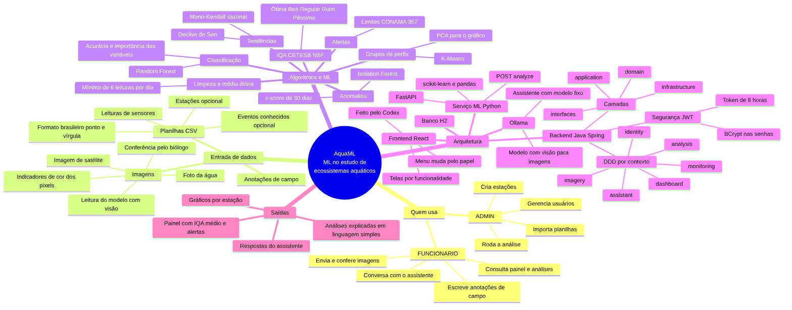
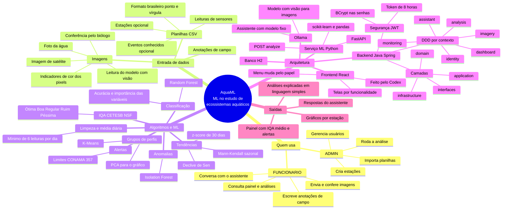

# AquaML — Mapa mental

Visão geral do sistema em um mapa só.

Versão editável (Mermaid):

```mermaid
mindmap
  root((AquaML<br/>ML no estudo de<br/>ecossistemas aquáticos))
    Quem usa
      ADMIN
        Importa planilhas
        Roda a análise
        Cria estações
        Gerencia usuários
      FUNCIONARIO
        Envia e confere imagens
        Escreve anotações de campo
        Conversa com o assistente
        Consulta painel e análises
    Entrada de dados
      Imagens
        Foto da água
        Imagem de satélite
        Indicadores de cor dos pixels
        Leitura do modelo com visão
        Conferência pelo biólogo
      Planilhas CSV
        Leituras de sensores
        Estações opcional
        Eventos conhecidos opcional
        Formato brasileiro ponto e vírgula
      Anotações de campo
    Algoritmos e ML
      Limpeza e média diária
        Mínimo de 6 leituras por dia
      IQA CETESB NSF
        Ótima Boa Regular Ruim Péssima
      Anomalias
        Isolation Forest
        z-score de 30 dias
      Classificação
        Random Forest
        Acurácia e importância das variáveis
      Grupos de perfis
        K-Means
        PCA para o gráfico
      Tendências
        Mann-Kendall sazonal
        Declive de Sen
      Alertas
        Limites CONAMA 357
    Arquitetura
      Frontend React
        Feito pelo Codex
        Telas por funcionalidade
        Menu muda pelo papel
      Backend Java Spring
        DDD por contexto
          identity
          monitoring
          analysis
          imagery
          assistant
          dashboard
        Camadas
          domain
          application
          infrastructure
          interfaces
        Segurança JWT
          Token de 8 horas
          BCrypt nas senhas
      Serviço ML Python
        FastAPI
        scikit-learn e pandas
        POST analyze
      Banco H2
      Ollama
        Assistente com modelo fixo
        Modelo com visão para imagens
    Saídas
      Painel com IQA médio e alertas
      Gráficos por estação
      Análises explicadas em linguagem simples
      Respostas do assistente
```
